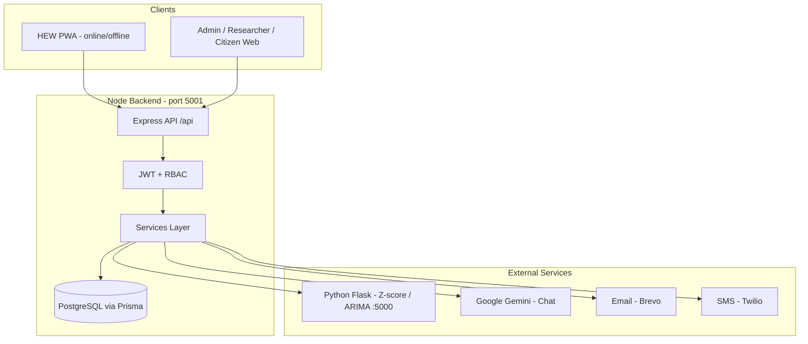
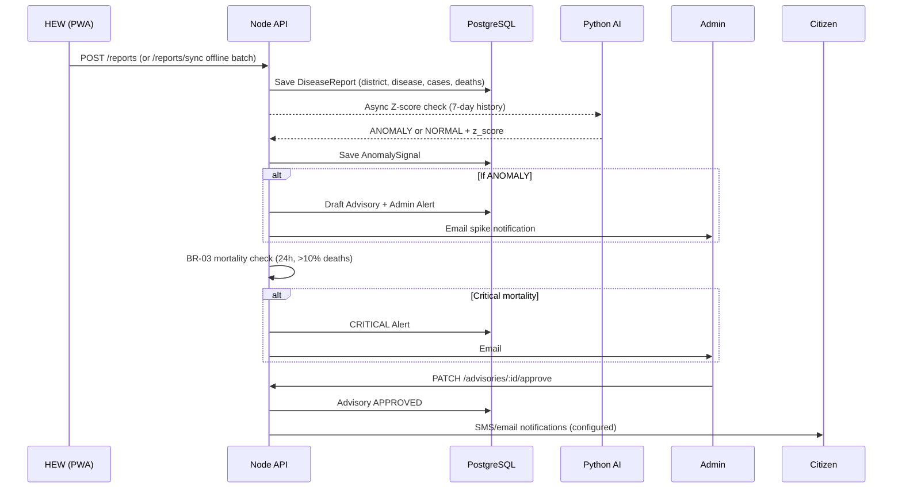
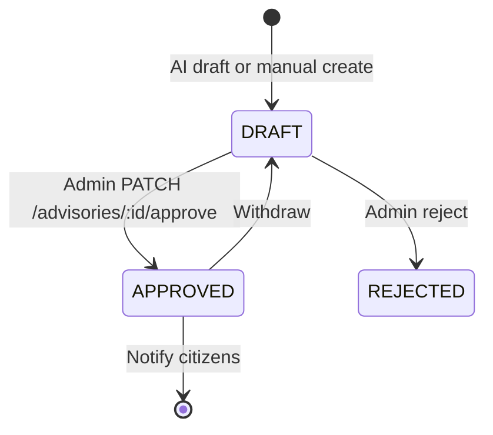

# EthioSentinel Backend — Defense Guide

This document explains how the **EthioSentinel** backend works: architecture, data flow, and main features (anomaly detection, prediction, AI chat, offline sync, alerts, and advisories). Use it to prepare for project defense or onboarding.

---

## 1. High-level architecture




### Layers


| Layer           | Responsibility                                   |
| --------------- | ------------------------------------------------ |
| **Routes**      | HTTP endpoints, auth middleware, role checks     |
| **Controllers** | Parse request, call service, return JSON         |
| **Services**    | Business logic (reports, alerts, AI, chat, sync) |
| **Prisma**      | ORM + migrations for PostgreSQL                  |
| **Utils**       | Email, SMS, JWT, validation, logging             |


**Stack:** Node.js + Express + Prisma + PostgreSQL. A separate **Python Flask** service (`anomaly-detection-service/`) handles Z-score and ARIMA. The React frontend/PWA calls this API.

---

## 2. Who uses the system (roles)


| Role            | Typical use                                                                        |
| --------------- | ---------------------------------------------------------------------------------- |
| **HEW**         | Submit disease reports (cases/deaths) from the field, often via PWA                |
| **ADMIN**       | Review advisories/alerts, approve broadcasts, see regional data                    |
| **RESEARCHER**  | Read analytics, anomalies, reports (read-heavy)                                    |
| **CITIZEN**     | Public symptom checker, public chat, view approved advisories/alerts in their area |
| **SUPER_ADMIN** | Platform oversight, audit, user management                                         |


**Auth:** JWT (cookie/header), bcrypt passwords, OTP on registration/password reset (email or SMS via Brevo/Twilio).

---

## 3. General end-to-end flow




**One-line summary:** Field workers **report** → data is **stored** → **AI/statistics** flag spikes → **admins review** advisories/alerts → **approved guidance** reaches citizens.

---

## 4. Core data entities (database)


| Model                              | Purpose                                                            |
| ---------------------------------- | ------------------------------------------------------------------ |
| **Region / District**              | Ethiopia geography (map, dashboards)                               |
| **HealthFacility**                 | Clinics/HCs with coordinates (map, chat “nearby facilities”)       |
| **User**                           | HEW, admin, etc. (region, district, optional facility link)        |
| **Disease**                        | Master list (name, symptoms profile)                               |
| **DiseaseReport**                  | Cases + deaths per district/disease/time (main surveillance input) |
| **AnomalySignal**                  | Z-score/ARIMA result per check (“spike” record)                    |
| **Advisory**                       | Health guidance text (DRAFT → APPROVED)                            |
| **Alert**                          | Notifications (severity, channel, target zone)                     |
| **ChatConversation / ChatMessage** | AI assistant history                                               |
| **AuditLog**                       | Super-admin actions                                                |


Schema: `prisma/schema.prisma`

---

## 5. Main API areas


| Prefix                                        | What it does                                                      |
| --------------------------------------------- | ----------------------------------------------------------------- |
| `/api/auth`                                   | Login, register, OTP, password reset                              |
| `/api/reports`                                | Create/update reports, **offline sync**                           |
| `/api/analytics`                              | Aggregations, anomaly list, **ad-hoc Z-score & ARIMA prediction** |
| `/api/ai`                                     | Trigger anomaly, webhooks, internal NLP draft ingest              |
| `/api/advisories`                             | Advisories, **chat**, symptom checker                             |
| `/api/alerts`                                 | Alert CRUD, approve/reject, citizen notifications                 |
| `/api/public-health`                          | Regional dashboard (cases, deaths, spikes, risk levels)           |
| `/api/regions`, `/api/diseases`, `/api/users` | Reference data & admin                                            |
| `/api/super-admin`                            | Audit logs, system stats                                          |
| `/api/health`                                 | Health facility listings                                          |
| `/api/docs`                                   | Swagger API documentation                                         |


---

## *6. Anomaly detection (automatic spikes)*

### Trigger

Every new report (online or after offline sync) calls:

- `AIService.enqueueZScoreAnomalyTrigger(reportId)`  
- Used from: `src/services/report.service.ts`, `src/services/report-sync.service.ts`

### Pipeline

1. Load same **district + disease** reports for the last **7 days** (`LOOKBACK_DAYS` in `src/services/ai.service.ts`).
2. Compute **mean** and **standard deviation** of `caseCount`.
3. If `std_dev <= 0`, skip (no variance).
4. POST to Python service: `POST {AI_SERVICE_BASE_URL}/detect` with `method: "zscore"`.
5. Python (`anomaly-detection-service/app.py`):
  ```
   Z = (current_cases - historical_mean) / std_dev
   classification = ANOMALY if Z > 2 else NORMAL
  ```
6. Save `**AnomalySignal**` in PostgreSQL (both ANOMALY and NORMAL are stored).
7. If **ANOMALY**:
  - Create **draft advisory** (AI-suggested).
  - Create **admin alert** and optional **email** to admins.

### Dashboard “Spikes”

- **Not** recalculated on the dashboard.
- Count of `AnomalySignal` rows where `classification = "ANOMALY"` in the selected time window.
- Implemented in `src/services/public-health.service.ts` → `GET /api/public-health/ethiopia/regions/status`.

### District risk badge (CRITICAL / HIGH / MODERATE / LOW)

Separate from Z-score. Function `riskFromCounts()` in `public-health.service.ts`:


| Level        | Rule (any one triggers)                            |
| ------------ | -------------------------------------------------- |
| **CRITICAL** | deaths ≥ 10 **or** spikes ≥ 3 **or** cases ≥ 1,000 |
| **HIGH**     | deaths ≥ 3 **or** spikes ≥ 1 **or** cases ≥ 250    |
| **MODERATE** | deaths ≥ 1 **or** cases ≥ 50                       |
| **LOW**      | otherwise                                          |


### Key files

- `src/services/ai.service.ts` — `triggerZScoreAnomaly`, `buildZScorePayload`, `persistAnomalySignal`
- `anomaly-detection-service/app.py` — `detect_with_zscore`, `detect_with_arima`

---

## 7. Prediction (forecasting)

**Not** run automatically on every report. Invoked on demand:

- **Endpoint:** `POST /api/analytics/predictions/run`
- **Service:** `AIService.runAdHocPrediction()` in `src/services/ai.service.ts`

**Requirements:**

- At least **9 reports** in the lookback window for the district + disease.
- Python **ARIMA** fits a time series, forecasts the next value, compares current cases to forecast residual.
- Default anomaly threshold for ARIMA: **Z > 1.5** (configurable in request).

**Demo data:** `npm run seed:prediction-demo` seeds ~40 days of synthetic reports for charts and testing.

**Z-score ad-hoc (manual):** `POST /api/analytics/zscore/run` — same logic as automatic trigger but analyst-driven.

---

## 8. AI chat

### Endpoints


| Endpoint                                   | Auth | Purpose              |
| ------------------------------------------ | ---- | -------------------- |
| `POST /api/advisories/chat/message`        | Yes  | Logged-in user chat  |
| `POST /api/advisories/chat/public/message` | No   | Public chat          |
| `GET /api/advisories/chat/history`         | Yes  | Conversation history |
| `DELETE /api/advisories/chat/history`      | Yes  | Clear history        |


### How it works

1. Resolve user **region** and **assigned district** (or limited context for public).
2. **Query database** for the user’s area:
  - Top diseases (cases, deaths, report counts)
  - Recent `AnomalySignal` (z-scores, classifications)
  - Approved advisories
  - Recent disease reports
  - Nearby **HealthFacility** records
3. Inject summaries as JSON into the **Google Gemini** prompt (`CHAT_BOT_NAME`, `GEMINI_API_KEY`).
4. System prompt instructs the model to **only use provided facts**, not invent case numbers.
5. Some questions (nearby facilities, “where was it reported”) use **deterministic** replies without the LLM.
6. Messages stored in `ChatConversation` / `ChatMessage`.

### Key file

- `src/services/chat.service.ts`

---

## 9. Offline synchronization (BR-05)

### Endpoint

`POST /api/reports/sync` — authenticated (HEW, ADMIN, SUPER_ADMIN)

### Flow

1. PWA stores reports locally while offline.
2. On reconnect, client sends a **batch** (max **200** reports).
3. Each item validated; failures return `{ index, reason }`.
4. Valid items sorted **mortality-first** (`deathCount > 0` before case-only reports).
5. All accepted rows saved in one **Prisma transaction** (atomic batch).
6. Fields set: `isOfflineCached: true`, `status: PENDING`, `isMortalityPriority` when deaths > 0.
7. **Post-persist hooks** (same as online submit):
  - `AIService.enqueueZScoreAnomalyTrigger(report.id)`
  - `AlertService.checkAndCreateCriticalMortalityAlert(diseaseType, district)` (BR-03)

### Key file

- `src/services/report-sync.service.ts`

---

## 10. Alerts

### Sources


| Source              | When                                                        | Typical severity                 |
| ------------------- | ----------------------------------------------------------- | -------------------------------- |
| **Z-score spike**   | New report classified as ANOMALY                            | HIGH (Z ≥ 2) or CRITICAL (Z ≥ 3) |
| **BR-03 mortality** | Last 24h for district+disease: ≥3 deaths or mortality > 10% | CRITICAL                         |
| **Manual**          | Admin/HEW creates alert                                     | Configurable                     |


### Workflow

1. Alert created (often `aiSuggested: true` for AI-driven ones).
2. Admin: `PUT /api/alerts/:id/approve` or `reject`.
3. Delivery via **EMAIL** (Brevo) and/or **SMS** (Twilio) per `channel`.
4. `deliveryCount` / `failedCount` / `isDelivered` tracked on the `Alert` model.

### Citizens

- `GET /api/alerts/notifications` — filtered by user region/district; only **delivered** alerts.

### Key file

- `src/services/alert.service.ts` — especially `checkAndCreateCriticalMortalityAlert` (BR-03)

---

## 11. Advisories

### Lifecycle




### Important points

- **AI-suggested drafts** are created when an anomaly is detected; they are **not** broadcast until an admin approves (**BR-02** intent).
- **Approve** → `notifyCitizensOnAdvisoryApproval` (SMS/email to citizens in scope).
- **Manual create:** `POST /api/advisories` (ADMIN, SUPER_ADMIN).
- **Draft queue:** `GET /api/advisories/drafts`.

### Symptom checker (separate feature)

- **Endpoint:** `POST /api/advisories/symptom-check` (public, no auth).
- **Implementation:** Rule-based in `AdvisoryService.checkSymptoms()` — **does not query the database**.
- Fixed patterns (e.g. fever+cough → respiratory infection). Location string is only used in advice text, not for epidemiology.

### Generate advisory text

- `POST /api/advisories/generate` — template-based copy (EN/AM) for admins/HEW.

### Key file

- `src/services/advisory.service.ts`

---

## 12. Symptom checker vs real surveillance data


| Feature            | Uses database? | Uses location/reports?                   |
| ------------------ | -------------- | ---------------------------------------- |
| Regional dashboard | Yes            | Yes — aggregates reports & anomalies     |
| AI chat            | Yes            | Yes — user region/district scope         |
| Automatic Z-score  | Yes            | Yes — 7-day history per district+disease |
| Symptom checker    | **No**         | **No** — hard-coded symptom rules only   |


---

## 13. Environment & local dev


| Variable                          | Purpose                                          |
| --------------------------------- | ------------------------------------------------ |
| `DATABASE_URL`                    | PostgreSQL connection                            |
| `JWT_SECRET`, `JWT_ACCESS_SECRET` | Tokens                                           |
| `AI_SERVICE_BASE_URL`             | Python service (default `http://127.0.0.1:5000`) |
| `AI_SERVICE_ZSCORE_PATH`          | Usually `/detect`                                |
| `GEMINI_API_KEY`                  | Chat                                             |
| `BREVO_API_KEY`, `EMAIL_FROM`     | Email                                            |
| `TWILIO_`*                        | SMS                                              |
| `SITESECRET`                      | reCAPTCHA v2 (login/register)                    |
| `FRONTEND_URL`                    | CORS / links                                     |


**Run backend + AI (Windows):**

```powershell
npm run dev:with-ai:win
```

**Python AI setup (once):**

```powershell
cd anomaly-detection-service
python -m venv .venv
.\.venv\Scripts\pip install -r requirements.txt
.\.venv\Scripts\python.exe app.py
```

**Database:**

```powershell
npm run db:migrate
npm run generate
npm run seed
```

---

## 14. Suggested demo order (defense)

1. Login as **HEW** → submit report → show spike/anomaly in analytics or public-health map.
2. Login as **Admin** → review draft advisories → approve → show alert notifications.
3. Explain **offline sync** (batch, mortality-first, same AI hooks).
4. **Chat** — ask about local area; show DB-grounded response.
5. Optional: **prediction** on seeded district (`seed:prediction-demo`).
6. **Symptom checker** — note it is triage rules today; future work = tie to local disease prevalence.

---

## 15. Likely panel questions (short answers)


| Question                     | Answer                                                                                                    |
| ---------------------------- | --------------------------------------------------------------------------------------------------------- |
| How is data collected?       | HEW submits `DiseaseReport` (district, disease, caseCount, deathCount) online or via `/reports/sync`.     |
| How do you detect outbreaks? | Z-score vs 7-day baseline (Python) + mortality threshold (BR-03).                                         |
| Human in the loop?           | Yes — advisories require admin **approve** before citizen broadcast.                                      |
| Offline support?             | PWA queues reports; backend sync with mortality-first ordering.                                           |
| What is “AI” here?           | Statistics (Z-score/ARIMA) for anomalies; Gemini for chat with DB context; symptom checker is rules-only. |
| Security?                    | JWT, RBAC, rate limits, helmet, bcrypt, audit logs.                                                       |


---

## 16. Related docs & code entry points


| Topic                           | Location                                |
| ------------------------------- | --------------------------------------- |
| Prisma schema                   | `prisma/schema.prisma`                  |
| Routes index                    | `src/routes/index.ts`                   |
| Report create + anomaly trigger | `src/services/report.service.ts`        |
| Offline sync                    | `src/services/report-sync.service.ts`   |
| AI / Z-score / prediction       | `src/services/ai.service.ts`            |
| Chat                            | `src/services/chat.service.ts`          |
| Public health dashboard         | `src/services/public-health.service.ts` |
| Python detect API               | `anomaly-detection-service/app.py`      |
| Anomaly service README          | `anomaly-detection-service/README.md`   |
| Seed main data                  | `npm run seed` → `src/scripts/seed.ts`  |
| Seed prediction demo            | `npm run seed:prediction-demo`          |


---

*Last updated for defense preparation. Align live demo with your current `.env` (local PostgreSQL vs Render) and ensure migrations are applied before seeding.*